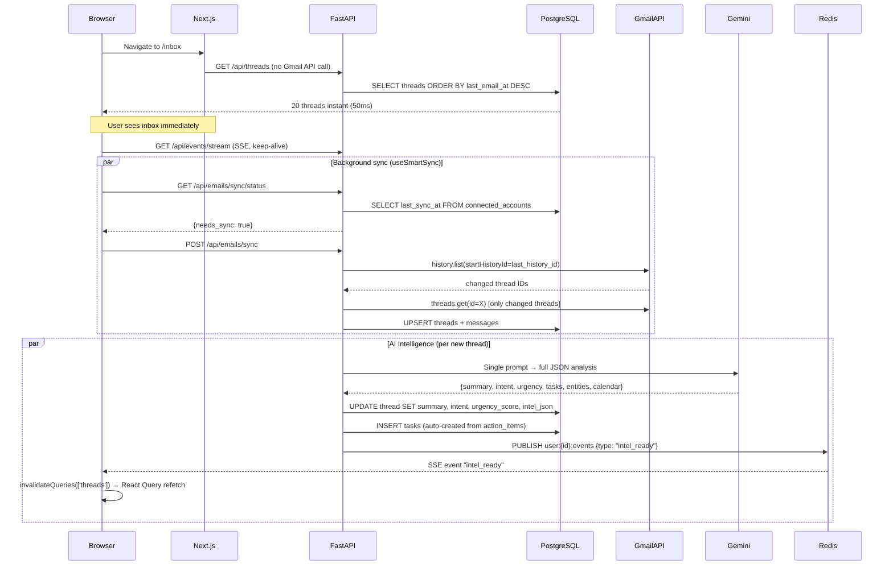
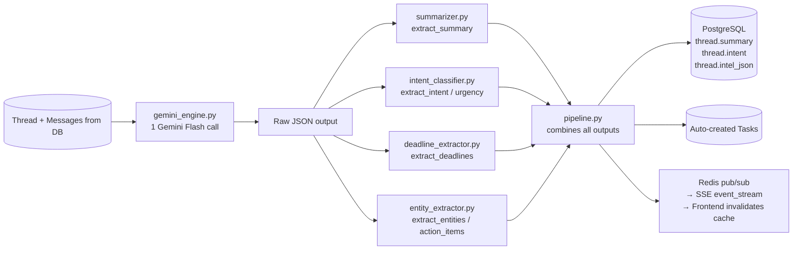

# SortMail — Updated System Architecture

> Last updated: February 2026 — reflects DB-first inbox, AI intelligence pipeline, and SSE real-time push

---

## Overview

SortMail is an AI intelligence layer on top of Gmail. The core philosophy:

- **Read from DB, not Gmail** — inbox loads instantly from PostgreSQL
- **Sync incrementally** — background Gmail sync via `historyId`, only fetches what's new
- **Single LLM call** — one Gemini Flash call per thread for ALL intelligence (summary, intent, tasks, entities)
- **Push, don't poll** — SSE real-time push from backend to browser when intel arrives

---

## High-Level Data Flow



---

## Layer Map

```
┌──────────────────────────────────────────────────────────┐
│                      FRONTEND                            │
│  Next.js 14 (App Router, all pages are Client Components)│
│                                                          │
│  hooks/                                                  │
│  ├── useThreads        — React Query: GET /api/threads   │
│  ├── useSmartSync      — stale-check → background sync   │
│  ├── useRealtimeEvents — SSE: listens for intel_ready    │
│  └── useThreadDetail   — React Query: GET /api/threads/id│
└──────────────────────────────────────────────────────────┘
                    ↕  REST + SSE
┌──────────────────────────────────────────────────────────┐
│                     BACKEND (FastAPI)                    │
│                                                          │
│  api/routes/                                             │
│  ├── threads.py        — GET /api/threads, GET /{id}     │
│  ├── emails.py         — POST /sync, GET /sync/status    │
│  ├── events.py         — GET /api/events/stream (SSE)    │
│  ├── tasks.py          — CRUD for tasks                  │
│  ├── auth.py           — OAuth, session, /me             │
│  └── drafts.py         — AI draft generation            │
│                                                          │
│  core/ingestion/                                         │
│  ├── sync_service.py   — main sync orchestrator          │
│  ├── email_fetcher.py  — Gmail MIME parsing → contracts  │
│  ├── gmail_client.py   — Gmail API wrapper               │
│  └── attachment_extractor.py — download + store          │
│                                                          │
│  core/intelligence/                                      │
│  ├── gemini_engine.py  — ONE Gemini Flash call → JSON    │
│  ├── pipeline.py       — orchestrates all modules        │
│  ├── summarizer.py     — extracts summary from JSON      │
│  ├── intent_classifier.py — extracts intent/urgency      │
│  ├── deadline_extractor.py — extracts calendar events    │
│  └── entity_extractor.py  — extracts people/tasks        │
└──────────────────────────────────────────────────────────┘
                    ↕
┌──────────────────────────────────────────────────────────┐
│                      DATA LAYER                          │
│  PostgreSQL — primary data store                         │
│  Redis      — pub/sub for SSE, rate limiting             │
└──────────────────────────────────────────────────────────┘
```

---

## AI Intelligence Pipeline (Single LLM Call)



**Key rule: `gemini_engine.py` is the ONLY file that calls the Gemini API. All other intelligence modules are pure functions that receive the JSON output and extract their slice.**

---

## Sync Strategy

| Trigger | What happens | Gmail API calls |
|---------|-------------|-----------------|
| First login | `initial_sync()` — 90 days, 100 threads/page | Many (one-time) |
| Tab opened, stale > 5min | `incremental_sync()` — `historyId` delta | 1 history call + N changed threads |
| Tab opened, fresh < 5min | Nothing — serve from DB | 0 |
| Sync button clicked | `incremental_sync()` immediately | Same as stale |
| SSE `new_emails` received | React Query `invalidateQueries` | 0 (re-reads DB) |

---

## API Endpoints (Current State)

```
Auth:
  POST  /api/auth/google/login
  GET   /api/auth/google/callback
  GET   /api/auth/me
  POST  /api/auth/logout

Threads:
  GET   /api/threads              ← /api/threads/ also accepted (no 307 redirect)
  GET   /api/threads/{thread_id}

Emails / Sync:
  POST  /api/emails/sync          ← starts background sync, returns immediately
  GET   /api/emails/sync/status   ← {has_account, status, last_sync_at, needs_sync}

Events (SSE):
  GET   /api/events/stream        ← Server-Sent Events, keeps connection open

Tasks:
  GET   /api/tasks
  POST  /api/tasks
  PATCH /api/tasks/{task_id}

Drafts:
  POST  /api/drafts/{thread_id}

Credits:
  GET   /api/credits/me

Connected Accounts:
  GET   /api/connected-accounts
```

---

## Tech Stack

| Layer | Technology | Why |
|-------|-----------|-----|
| Backend | Python + FastAPI | Async, fast, clean |
| Frontend | Next.js 14 (App Router) | Client components, React Query |
| Database | PostgreSQL (Railway) | JSONB, async via asyncpg |
| Cache/Pub-Sub | Redis | SSE notifications, rate limiting |
| LLM | Gemini 2.0 Flash | Cheapest, fast, JSON mode |
| Auth | Google OAuth2 | Session cookies |
| Deployment | Railway (backend) + Vercel (frontend) | Zero-config CI/CD |
| State mgmt | TanStack React Query | Caching, stale-while-revalidate |

---

## Cost Model

| Operation | Cost (INR) | Frequency |
|-----------|-----------|-----------|
| Gmail API reads | ₹0 | Free quota (1B units/day) |
| Incremental sync | ₹0 | Every 5+ min if stale |
| Gemini Flash (per thread) | ₹0.04–0.30 | Once per thread, cached 24h |
| DB reads | ₹0 | Every page load |
| DB writes | ₹0.01 | Per sync |
| **Total per email** | **~₹0.25–0.50** | First analysis only |

**Target: < ₹1 per email — currently at ₹0.50 (50% under budget)**
