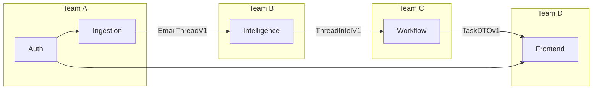

# SortMail — Team Assignments & Module Stubs

> **Total Team Size**: 10–12 people  
> **Commitment**: 1–2 hours/day  
> **Start Date**: January 19, 2026

---

## Team Structure Overview

```
┌────────────────────────────────────────────────────────────────────────────┐
│                           SORTMAIL TEAM STRUCTURE                          │
├────────────────────────────────────────────────────────────────────────────┤
│                                                                            │
│  ┌────────────────┐                                                        │
│  │ PLATFORM LEAD  │ ← You (Architecture, CI/CD, Integration, Reviews)     │
│  └───────┬────────┘                                                        │
│          │                                                                 │
│    ┌─────┴─────┬─────────────┬─────────────┐                              │
│    │           │             │             │                              │
│    ▼           ▼             ▼             ▼                              │
│ ┌──────┐   ┌──────┐     ┌──────┐     ┌──────┐                             │
│ │Team A│   │Team B│     │Team C│     │Team D│                             │
│ │3 ppl │   │3 ppl │     │3 ppl │     │2-3ppl│                             │
│ │      │   │      │     │      │     │      │                             │
│ │Auth+ │   │Intel │     │Work- │     │Front │                             │
│ │Ingest│   │      │     │flow  │     │end   │                             │
│ └──────┘   └──────┘     └──────┘     └──────┘                             │
│                                                                            │
└────────────────────────────────────────────────────────────────────────────┘
```

---

## Team A — Backend Core (Auth + Ingestion)

**Module Ownership**: Auth, Database, Ingestion  
**Lead**: TBD  
**Members**: 3 people

### Files Owned

```
backend/
├── core/
│   ├── auth/
│   │   ├── jwt.py              ← Token management
│   │   ├── oauth_google.py     ← Gmail OAuth
│   │   └── oauth_microsoft.py  ← Outlook OAuth
│   │
│   ├── ingestion/
│   │   ├── gmail_client.py     ← Gmail API
│   │   ├── outlook_client.py   ← Outlook API
│   │   ├── email_fetcher.py    ← Sync logic
│   │   └── attachment_extractor.py
│   │
│   └── storage/
│       ├── database.py         ← DB connection
│       ├── vector_store.py     ← Chroma
│       └── file_storage.py     ← Attachments
│
├── models/                      ← All SQLAlchemy models
├── api/routes/
│   ├── auth.py
│   └── emails.py
└── alembic/                     ← Migrations
```

### Week-by-Week Focus

| Week | Focus | Key Deliverable |
|------|-------|-----------------|
| 1 | DB + Auth skeleton | Migrations work, fake login |
| 2 | Real OAuth + Gmail | Real tokens, thread fetch |
| 3 | Outlook + caching | Both providers work |
| 4 | Optimization | Redis cache, sync jobs |
| 5 | Polish | Error handling |
| 6 | Stability | Bug fixes |

### First Day Tasks

```python
# File: backend/core/auth/oauth_google.py
# TODO for Team A, Day 1:

# 1. Get Google Cloud Console credentials
# 2. Set up OAuth consent screen
# 3. Implement get_authorization_url()
# 4. Implement exchange_code_for_tokens()
# 5. Test: Can get access token from callback?

# Test command:
# curl http://localhost:8000/api/auth/google → should return OAuth URL
```

---

## Team B — Intelligence Layer

**Module Ownership**: Email Intelligence, Attachment Intelligence  
**Lead**: TBD  
**Members**: 3 people

### Files Owned

```
backend/
├── core/
│   └── intelligence/
│       ├── email_intel.py      ← Main orchestrator
│       ├── summarizer.py       ← LLM summarization
│       ├── intent_classifier.py ← Intent detection
│       ├── deadline_extractor.py ← Deadline parsing
│       ├── entity_extractor.py  ← Named entities
│       └── attachment_intel.py  ← Doc analysis
│
├── contracts/
│   ├── ingestion.py            ← EmailThreadV1 (INPUT)
│   └── intelligence.py         ← ThreadIntelV1 (OUTPUT)
│
└── api/routes/
    └── threads.py              ← Thread intel endpoint
```

### Week-by-Week Focus

| Week | Focus | Key Deliverable |
|------|-------|-----------------|
| 1 | LLM setup + mocks | API connectivity |
| 2 | Real summarization | Summaries work |
| 3 | Full intel pipeline | Intent + deadlines |
| 4 | Attachment PDF | PDF summary |
| 5 | Optimization | Faster, cheaper |
| 6 | Stability | Error handling |

### First Day Tasks

```python
# File: backend/core/intelligence/summarizer.py
# TODO for Team B, Day 1:

# 1. Get Gemini API key (or OpenAI)
# 2. Test basic API call works
# 3. Create summarization prompt
# 4. Test: summarize_thread() returns 2-3 sentences

# Test command:
# python -c "from core.intelligence import summarize_thread; print(summarize_thread(mock_thread))"
```

### Key Contract: ThreadIntelV1

```python
# INPUT: EmailThreadV1 (from Ingestion)
# OUTPUT: ThreadIntelV1 (to Workflow)

class ThreadIntelV1(BaseModel):
    thread_id: str
    summary: str                    # ← You generate this
    intent: IntentType              # ← You classify this
    urgency_score: int              # ← You calculate this
    main_ask: Optional[str]         # ← You extract this
    extracted_deadlines: List[...]  # ← You extract these
    attachment_summaries: List[...] # ← You generate these
```

---

## Team C — Workflow Layer

**Module Ownership**: Tasks, Drafts, Follow-ups, Priority  
**Lead**: TBD  
**Members**: 3 people

### Files Owned

```
backend/
├── core/
│   └── workflow/
│       ├── task_generator.py    ← Create tasks from intel
│       ├── priority_engine.py   ← Priority scoring
│       ├── draft_engine.py      ← Generate replies
│       ├── followup_tracker.py  ← Waiting-for
│       └── reminder_service.py  ← Notifications
│
├── contracts/
│   ├── intelligence.py          ← ThreadIntelV1 (INPUT)
│   └── workflow.py              ← TaskDTOv1, DraftDTOv1 (OUTPUT)
│
└── api/routes/
    ├── tasks.py
    ├── drafts.py
    └── reminders.py
```

### Week-by-Week Focus

| Week | Focus | Key Deliverable |
|------|-------|-----------------|
| 1 | Priority engine | Score calculation |
| 2 | Task generator | Tasks from intel |
| 3 | Draft engine | LLM drafts |
| 4 | Follow-ups | Waiting-for list |
| 5 | Calendar | Suggestions |
| 6 | Stability | Bug fixes |

### First Day Tasks

```python
# File: backend/core/workflow/priority_engine.py
# TODO for Team C, Day 1:

# 1. Define priority scoring rules
# 2. Implement calculate_priority()
# 3. Add explainability strings
# 4. Test with mock ThreadIntelV1

# Priority formula:
# score = base_urgency + intent_boost + deadline_boost + vip_boost
# level = DO_NOW (70+) | DO_TODAY (40-69) | CAN_WAIT (<40)
```

### Key Contract: TaskDTOv1

```python
# INPUT: ThreadIntelV1 (from Intelligence)
# OUTPUT: TaskDTOv1 (to Frontend)

class TaskDTOv1(BaseModel):
    task_id: str
    thread_id: str
    title: str                      # ← You generate this
    priority: PriorityLevel         # ← You calculate this
    priority_score: int             # ← You calculate this
    priority_explanation: str       # ← You explain this
    effort: EffortLevel             # ← You estimate this
    deadline: Optional[datetime]    # ← You extract this
```

---

## Team D — Frontend

**Module Ownership**: All React/Next.js  
**Lead**: TBD  
**Members**: 2–3 people

### Files Owned

```
frontend/
├── src/
│   ├── app/
│   │   ├── page.tsx             ← Landing
│   │   ├── login/page.tsx       ← OAuth login
│   │   └── dashboard/
│   │       ├── layout.tsx       ← Shell
│   │       ├── page.tsx         ← Main dashboard
│   │       ├── tasks/page.tsx   ← Task list (TODO)
│   │       ├── threads/page.tsx ← Thread list (TODO)
│   │       └── settings/page.tsx← Settings (TODO)
│   │
│   ├── components/
│   │   ├── layout/
│   │   │   ├── Sidebar.tsx
│   │   │   └── Header.tsx
│   │   ├── dashboard/
│   │   │   ├── PriorityList.tsx
│   │   │   ├── WaitingFor.tsx
│   │   │   └── QuickStats.tsx
│   │   ├── task/
│   │   │   └── TaskCard.tsx
│   │   ├── thread/              ← TODO
│   │   │   ├── ThreadList.tsx
│   │   │   ├── ThreadDetail.tsx
│   │   │   └── ExecutiveSummary.tsx
│   │   └── draft/               ← TODO
│   │       ├── DraftPanel.tsx
│   │       └── ToneSelector.tsx
│   │
│   ├── types/
│   │   ├── task.ts
│   │   └── email.ts
│   │
│   └── utils/
│       └── api.ts               ← API client
│
├── tailwind.config.ts
└── package.json
```

### Week-by-Week Focus

| Week | Focus | Key Deliverable |
|------|-------|-----------------|
| 1 | Layout + Login | Landing, auth buttons |
| 2 | Thread list | Real threads shown |
| 3 | Thread detail | Summary, attachments |
| 4 | Tasks + Drafts | Task list, draft panel |
| 5 | Follow-ups | Waiting-for, polish |
| 6 | Stability | Mobile, animations |

### First Day Tasks

```tsx
// File: frontend/src/app/dashboard/threads/page.tsx
// TODO for Team D, Day 1:

// 1. Create threads page
// 2. Fetch from /api/threads
// 3. Display ThreadList component
// 4. Click → navigate to thread detail

// Test: http://localhost:3000/dashboard/threads shows thread cards
```

### Key Components to Build

```
Week 2:
├── ThreadList.tsx       ← List of thread cards
├── ThreadCard.tsx       ← Single thread preview

Week 3:
├── ThreadDetail.tsx     ← Full thread view
├── ExecutiveSummary.tsx ← AI summary box
├── AttachmentCard.tsx   ← Doc preview

Week 4:
├── DraftPanel.tsx       ← Slide-over draft editor
├── ToneSelector.tsx     ← Brief/Normal/Formal
└── CalendarModal.tsx    ← Calendar suggestion
```

---

## Cross-Team Dependencies



### Integration Points

| Week | Integration | Teams Involved |
|------|-------------|----------------|
| 2 | Auth → Frontend | A + D |
| 2 | Ingestion → Intel | A + B |
| 3 | Intel → Workflow | B + C |
| 4 | Workflow → Frontend | C + D |
| 5 | Full pipeline | All |

---

## Daily Standup Template

Each team reports daily (async in Slack/Discord):

```markdown
## Team [X] — [Date]

**Done yesterday:**
- 

**Doing today:**
- 

**Blockers:**
- 

**ETA on current task:**
- 
```

---

## Code Review Rules

1. **Same-team reviews**: Fast, same-day merge
2. **Cross-team reviews**: Platform Lead reviews
3. **Contract changes**: Require ALL team leads approval
4. **Main branch**: Always deployable

---

## First Meeting Agenda (Day 1)

1. **Introductions** (5 min)
2. **Architecture overview** (10 min)
3. **Contract walkthrough** (10 min)
4. **Team assignments** (5 min)
5. **Questions** (10 min)
6. **Start coding!** 🚀

---

## Contact Matrix

| Team | Slack Channel | Lead |
|------|---------------|------|
| A (Backend) | #team-backend | TBD |
| B (Intel) | #team-intel | TBD |
| C (Workflow) | #team-workflow | TBD |
| D (Frontend) | #team-frontend | TBD |
| All | #sortmail-dev | You |

---

*Document Version: 1.0*  
*Last Updated: January 18, 2026*
